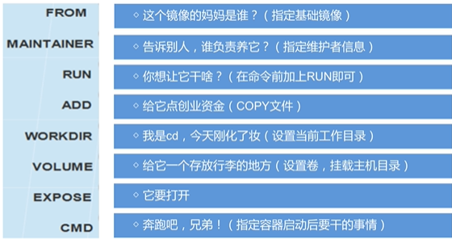
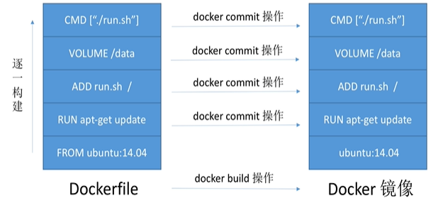
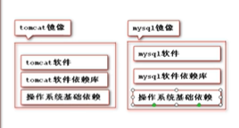
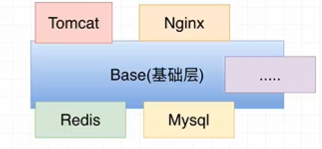
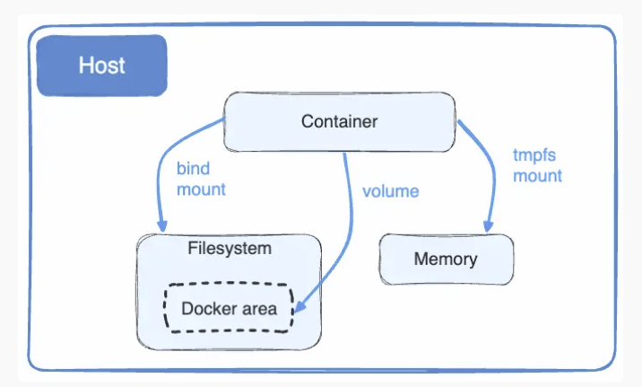

## 1、简介

**Docker**是一个开源的应用容器引擎；是一个轻量级容器技术；

Docker 支持将软件编译成一个镜像；然后在镜像中各种软件做好配置，将镜像发布出去，其他使用者可以直接使用这个镜像；

运行中的这个镜像称为容器，容器启动是非常快速的。


基本工作流程：

Docker 使用客户端-服务器架构。Docker *客户端*与 Docker *守护进程*进行对话，该*守护进程*完成了构建，运行和分发 Docker 容器的繁重工作。Docker 客户端和守护程序*可以* 在同一系统上运行，也可以将 Docker 客户端连接到远程 Docker 守护程序。Docker 客户端和守护程序在网络接口上使用 REST API 进行通信。

**Docker 守护程序（Docker daemon）**

Docker 守护程序侦听 Docker API 请求并管理 Docker 对象，例如图像，容器，网络和卷。守护程序还可以与其他守护程序通信以管理 Docker 服务。

**Docker 客户端（Client）**

Docker 客户端是 Docker 用户与 Docker 交互的主要方式。当您使用诸如`docker run`之类的命令时，客户端会将这些命令发送到`Docker daemon`，以执行这些命令。Docker 客户端可以与多个守护程序通信。

**Docker 注册中心（Registry）**

Docker *注册中心*存储 Docker 镜像。Docker Hub 是任何人都可以使用的公共注册中心（远程/中央仓库），并且 Docker 默认配置为在 Docker Hub 上查找映像。

使用`docker pull`或`docker run`命令时，所需的镜像将从配置的中央仓库中提取。使用`docker push`命令时，会将镜像推送到配置的注册中心。

## 2、核心概念

docker 主机(Host)：安装了 Docker 程序的机器（Docker 直接安装在操作系统之上）；

docker 客户端(Client)：连接 docker 主机进行操作；

docker 仓库(Registry)：用来保存各种打包好的软件镜像；全球应该有一个维护仓库。称为远程仓库。从远程仓库可以通过 `docker pull` 命令拉去镜像。远程搜索界面 docker Hub，远程仓库的 Web 界面，可以用来搜索远程仓库是否存在某个镜像。

docker 镜像(Images)：软件打包好的镜像；放在 docker 仓库中；一个镜像就可以代表一个软件。

docker 容器(Container)：镜像可以使用 `docker run`启动后的实例称为一个容器；容器是独立运行的一个或一组应用。一个镜像可以对应多个容器。


使用 Docker 的步骤：

1）、安装 Docker

2）、去 Docker 仓库找到这个软件对应的镜像；

3）、使用 Docker 运行这个镜像，这个镜像就会生成一个 Docker 容器；

4）、对容器的启动停止就是对软件的启动停止；

## 3、安装 Docker

#### 1）、安装 linux 虚拟机

 1）、VMWare、VirtualBox（安装）；

 2）、导入虚拟机文件 centos7-atguigu.ova；

 3）、双击启动 linux 虚拟机;使用 root/ 123456 登陆

 4）、使用客户端连接 linux 服务器进行命令操作；

 5）、设置虚拟机网络；

 桥接网络===选好网卡====接入网线；

 6）、设置好网络以后使用命令重启虚拟机的网络

```shell
service network restart
```

 7）、查看 linux 的 ip 地址

```shell
ip addr
```

 8）、使用客户端连接 linux；

#### 2）、在 linux 虚拟机上安装 docker

步骤：

```shell
1、检查内核版本，必须是3.10及以上
uname -r
2、安装docker
yum install docker
3、输入y确认安装
4、启动docker
[root@localhost ~]# systemctl start docker
[root@localhost ~]# docker -v
Docker version 1.12.6, build 3e8e77d/1.12.6
5、开机启动docker
[root@localhost ~]# systemctl enable docker
Created symlink from /etc/systemd/system/multi-user.target.wants/docker.service to /usr/lib/systemd/system/docker.service.
6、停止docker
systemctl stop docker
```

## 4、Docker 常用命令&操作

### 1）、镜像操作

| 操作 | 命令                                         | 说明                                                       |
| ---- | -------------------------------------------- | ---------------------------------------------------------- |
| 检索 | docker search 关键字 eg：docker search redis | 我们经常去 docker hub 上检索镜像的详细信息，如镜像的 TAG。 |
| 拉取 | docker pull 镜像名:tag                       | :tag 是可选的，tag 表示标签，多为软件的版本，默认是 latest |
| 列表 | docker images                                | 查看所有本地镜像                                           |
| 删除 | docker rmi image-id                          | 删除指定的本地镜像                                         |

https://hub.docker.com/

根据镜像启动容器：

```cmd
docker run --name mytomcat -d tomcat:latest
```

参数说明：


**获取镜像**

根据镜像名称拉取镜像

```
[root@docker01 ~]# docker pull centos
Using default tag: latest
latest: Pulling from library/centos
af4b0a2388c6: Downloading  34.65MB/73.67MB
```

查看当前主机镜像列表

```
[root@docker01 ~]# docker image list
REPOSITORY          TAG                 IMAGE ID            CREATED             SIZE
centos              latest              ff426288ea90        3 weeks ago         207MB
nginx               latest              3f8a4339aadd        5 weeks ago         108MB
```

拉第三方镜像方法

```
docker pull index.tenxcloud.com/tenxcloud/httpd
```

**导出镜像**

```
[root@docker01 ~]# docker image list
REPOSITORY          TAG                 IMAGE ID            CREATED             SIZE
centos              latest              ff426288ea90        3 weeks ago         207MB
nginx               latest              3f8a4339aadd        5 weeks ago         108MB
# 导出
[root@docker01 ~]# docker image save centos > docker-centos.tar.gz
```

**删除镜像**

```
[root@docker01 ~]# docker image rm centos:latest
[root@docker01 ~]# docker image list
REPOSITORY          TAG                 IMAGE ID            CREATED             SIZE
nginx               latest              3f8a4339aadd        5 weeks ago         108MB
```

**导入镜像**

```
[root@docker01 ~]# docker image load -i docker-centos.tar.gz
e15afa4858b6: Loading layer  215.8MB/215.8MB
Loaded image: centos:latest
[root@docker01 ~]# docker image list
REPOSITORY          TAG                 IMAGE ID            CREATED             SIZE
centos              latest              ff426288ea90        3 weeks ago         207MB
nginx               latest              3f8a4339aadd        5 weeks ago         108MB
```

**查看镜像的详细信息**

```
[root@docker01 ~]# docker image inspect centos
```

### 2）、容器操作

软件镜像（QQ 安装程序）----运行镜像----产生一个容器（正在运行的软件，运行的 QQ）；

步骤：

```shell
1、搜索镜像
[root@localhost ~]# docker search tomcat
2、拉取镜像
[root@localhost ~]# docker pull tomcat
3、根据镜像启动容器
docker run --name mytomcat -d tomcat:latest
4、docker ps
查看运行中的容器
5、 停止运行中的容器
docker stop  容器的id
6、查看所有的容器
docker ps -a
7、启动容器
docker start 容器id
8、删除一个容器
 docker rm 容器id
9、启动一个做了端口映射的tomcat
[root@localhost ~]# docker run -d -p 8888:8080 tomcat
-d：后台运行
-p: 将主机的端口映射到容器的一个端口    主机端口:容器内部的端口

10、为了演示简单关闭了linux的防火墙
service firewalld status ；查看防火墙状态
service firewalld stop：关闭防火墙
11、查看容器的日志
docker logs container-name/container-id

更多命令参看
https://docs.docker.com/engine/reference/commandline/docker/
可以参考每一个镜像的文档

```

查看正在运行的容器

```
[root@docker01 ~]# docker container ls
    或
[root@docker01 ~]# docker ps
CONTAINER ID        IMAGE               COMMAND                  CREATED             STATUS              PORTS               NAMES
8708e93fd767        nginx               "nginx -g 'daemon of…"   6 seconds ago       Up 4 seconds        80/tcp              keen_lewin
```

查看你容器详细信息/ip

```
[root@docker01 ~]# docker container  inspect  容器名称/id
```

查看你所有容器（包括未运行的）

```
[root@docker01 ~]# docker ps -a
CONTAINER ID        IMAGE               COMMAND                  CREATED             STATUS                      PORTS               NAMES
8708e93fd767        nginx               "nginx -g 'daemon of…"   4 minutes ago       Exited (0) 59 seconds ago                       keen_lewin
f9f3e6af7508        nginx               "nginx -g 'daemon of…"   5 minutes ago       Exited (0) 5 minutes ago                        optimistic_haibt
8d8f81da12b5        nginx               "nginx -g 'daemon of…"   3 hours ago         Exited (0) 3 hours ago                          lucid_bohr
```

停止容器

```
[root@docker01 ~]# docker stop 容器名称/id
或
[root@docker01 ~]# docker container  kill  容器名称/id

```

**进入容器方法**

**启动时进去方法**

```
[root@docker01 ~]# docker run -it #参数：-it 可交互终端
[root@docker01 ~]# docker run -it nginx:latest  /bin/bash
root@79241093859e:/#
```

退出/离开容器

```
ctrl+p & ctrl+q
```

**启动后进入容器的方法**

启动一个 docker

```
[root@docker01 ~]# docker run -it centos:latest
[root@1bf0f43c4d2f /]# ps -ef
UID         PID   PPID  C STIME TTY          TIME CMD
root          1      0  0 15:47 pts/0    00:00:00 /bin/bash
root         13      1  0 15:47 pts/0    00:00:00 ps -ef
```

attach 进入容器，使用 pts/0 ，会让所用通过此方法进如放入用户看到同样的操作。

```
[root@docker01 ~]# docker attach 1bf0f43c4d2f
[root@1bf0f43c4d2f /]# ps -ef
UID         PID   PPID  C STIME TTY          TIME CMD
root          1      0  0 15:47 pts/0    00:00:00 /bin/bash
root         14      1  0 15:49 pts/0    00:00:00 ps -ef
```

自命名启动一个容器 --name

```
[root@docker01 ~]# docker attach 1bf0f43c4d2f
[root@1bf0f43c4d2f /]# ps -ef
UID         PID   PPID  C STIME TTY          TIME CMD
root          1      0  0 15:47 pts/0    00:00:00 /bin/bash
root         14      1  0 15:49 pts/0    00:00:00 ps -ef
```

exec 进入容器方法（推荐使用）

```
[root@docker01 ~]# docker exec -it clsn1  /bin/bash
[root@b20fa75b4b40 /]# 重新分配一个终端
[root@b20fa75b4b40 /]# ps -ef
UID         PID   PPID  C STIME TTY          TIME CMD
root          1      0  0 16:11 pts/0    00:00:00 /bin/bash
root         13      0  0 16:14 pts/1    00:00:00 /bin/bash
root         26     13  0 16:14 pts/1    00:00:00 ps -ef
```

**删除所有容器**

```
[root@docker01 ~]# docker rm -f  `docker ps -a -q`
# -f 强制删除
```

**启动时进行端口映射**

-p 参数端口映射

```
[root@docker01 ~]# docker run -d -p 8888:80  nginx:latest
287bec5c60263166c03e1fc5b0b8262fe76507be3dfae4ce5cd2ee2d1e8a89a9
```

### 3）、安装 MySQL 示例

```shell
docker pull mysql
```

错误的启动

```shell
[root@localhost ~]# docker run --name mysql01 -d mysql
42f09819908bb72dd99ae19e792e0a5d03c48638421fa64cce5f8ba0f40f5846

mysql退出了
[root@localhost ~]# docker ps -a
CONTAINER ID        IMAGE               COMMAND                  CREATED             STATUS                           PORTS               NAMES
42f09819908b        mysql               "docker-entrypoint.sh"   34 seconds ago      Exited (1) 33 seconds ago                            mysql01
538bde63e500        tomcat              "catalina.sh run"        About an hour ago   Exited (143) About an hour ago                       compassionate_
goldstine
c4f1ac60b3fc        tomcat              "catalina.sh run"        About an hour ago   Exited (143) About an hour ago                       lonely_fermi
81ec743a5271        tomcat              "catalina.sh run"        About an hour ago   Exited (143) About an hour ago                       sick_ramanujan


//错误日志
[root@localhost ~]# docker logs 42f09819908b
error: database is uninitialized and password option is not specified
  You need to specify one of MYSQL_ROOT_PASSWORD, MYSQL_ALLOW_EMPTY_PASSWORD and MYSQL_RANDOM_ROOT_PASSWORD；这个三个参数必须指定一个
```

正确的启动

```shell
[root@localhost ~]# docker run --name mysql01 -e MYSQL_ROOT_PASSWORD=123456 -d mysql
b874c56bec49fb43024b3805ab51e9097da779f2f572c22c695305dedd684c5f
[root@localhost ~]# docker ps
CONTAINER ID        IMAGE               COMMAND                  CREATED             STATUS              PORTS               NAMES
b874c56bec49        mysql               "docker-entrypoint.sh"   4 seconds ago       Up 3 seconds        3306/tcp            mysql01
```

做了端口映射

```shell
[root@localhost ~]# docker run -p 3306:3306 --name mysql02 -e MYSQL_ROOT_PASSWORD=123456 -d mysql
ad10e4bc5c6a0f61cbad43898de71d366117d120e39db651844c0e73863b9434
[root@localhost ~]# docker ps
CONTAINER ID        IMAGE               COMMAND                  CREATED             STATUS              PORTS                    NAMES
ad10e4bc5c6a        mysql               "docker-entrypoint.sh"   4 seconds ago       Up 2 seconds        0.0.0.0:3306->3306/tcp   mysql02
```

几个其他的高级操作

```
docker run --name mysql03 -v /conf/mysql:/etc/mysql/conf.d -e MYSQL_ROOT_PASSWORD=my-secret-pw -d mysql:tag
把主机的/conf/mysql文件夹挂载到 mysqldocker容器的/etc/mysql/conf.d文件夹里面
改mysql的配置文件就只需要把mysql配置文件放在自定义的文件夹下（/conf/mysql）

docker run --name some-mysql -e MYSQL_ROOT_PASSWORD=my-secret-pw -d mysql:tag --character-set-server=utf8mb4 --collation-server=utf8mb4_unicode_ci
指定mysql的一些配置参数
```





一层层打包镜像，然后使用 docker run 将 Docker 镜像生成 Docker 容器。

镜像是只读的，只要不 build，别人再拉去镜像还是和原本的一样。操作的只是读写层，修改读写层的文件。


# Docker 镜像原理

镜像比原本的程序大得多，是一系列可独立运行的软件包，

分层的设计，如果全部都打包会有很多重复的内容依赖，所以 Docker 将粒度分的很细，应用的公共部分就可以重用，称为 Base 镜像，这样抽取的粒度越细，可重用性越高。



上述称为联合文件系统。



主要包括：

Bootfs：主要包含 bootloader 和 Kemel。

rootfs：在 boots 之上，包含的就是典型的 linux 系统中的/dev ,/proc,， /bin，/etc 等标准的目录和文件。rootfs 就是各种不同的操作系统发行版。

不同的 linux 发行版本,他们的 bootfs 是一致的，roofs 会有差别。

# 网络通信配置

docker 允许通过访问容器或网络互联的方式来提供网络服务。

docker 与宿主机的通信机制：

当 Docker 启动时，会自动在主机上创建一个 docker 虚拟网桥，实际上是 Linux 的一个 bridge，可以理解为一个软件交换机。它会在挂载到它的网口之间进行转发。

当创建一个 Docker 容器的时候，同时会创建了一对 veth pair 接口（当数据包发送到一个接口时，另外一个接口也可以收到相同的数据包)。这对接口一端在容器内，即 eth0 ;另一端在本地并被挂载到 dockere 网桥，名称以 veth 开头(例如 vethAQI20T )。通过这种方式，主机可以跟容器通信，容器之间也可以相互通信。Docker 就创建了在主机和所有容器之间一个虚拟共享网络。

同时，Docker 随机分配一个本地未占用的私有网段(在 RFC1918 中定义)中的一个地址给 docker 接口。比如典型的 172.17.42.1，掩码为 255.255.0.0。此后启动的容器内的网口也会自动分配一个同一网段(172.17.0.0/16 )的地址。

命令

```cmd
docker inspect 容器
```

所有容器都应用到同一个网桥，某些容器因为带宽影响，我们应该根据实际构建网桥。一般使用 docker 网桥实际容器与容器通信时，都是站在一个应用角度进行容器通信。

创建多余的网桥：

查看默认网桥：

```shell
docker network ls
```

创建自定义网桥

```shell
docker network 命令
```

新建网桥，一旦在启动容器时制定了网桥之后，日后可以在任何这个网桥关联的容器中使用容器名字进行与其他容器通信。

删除网桥

```shell
docker network rm 网桥名
```

# 数据卷

实现宿主机与容器之间实现数据共享的一种机制。

特点：

1：可以在容器之间实现共享与重用。

2：对数据卷的修改，会立即影响到容器。

3：数据卷会一直存在，容器删除并不会删除数据卷。

数据卷操作：

1：自定义数据卷目录

docker run -v 绝对路径：容器内路径

2：自动创建数据卷

docker run -v 卷名 容器内路径


# CGroup

docker基于Namespce和Cgroups，其中

- Namespace主要用于隔离资源
- Cgroups用来提供对一组进程以及将来子进程的资源限制

CGroup包含三个组件：

控制组：一个cgroup包含一组进程，并可以在这个cgroup上增加Linux subsystem的各种参数配置。

subsystem子系统：一组资源控制模块，可以通过lssubsys  -啊 命令查看当前内核支持哪些subsystem。subsystem作用于hierarchy的cgroup节点，并控制节点中进程的资源占用。

**hierarchy 层级树** 主要功能是把cgroups串成一个树型结构，使cgruops可以做到继承。也就是说将cgroup通过树状结构串起来，通过虚拟文件系统的方式暴露给用户。

三个组件的关系：

- 系统创建新的hierarchy之后，系统中所有的进程都会加入这个hierarchy的cgroup的根节点，这个cgroup根节点是hierarchy默认创建的，在这个hierarchy中创建的所有cgroup都是这个cgroup根节点的子节点。
- 一个subsystem只能附加到一个hierarchy上
- 一个hierarchy可以附加多个subsystem
- 一个进程可以作为多个cgroup的成员，但是这些cgroup必须在不同的hierarchy下
- 一个进程fork出子进程时，子进程和父进程是在同一个cgroup中的，根据需要也可以移动到其他的cgroup中

使用：

使用Cgroup对程序使用CPU进行限制；

```shell
cat cpu.cfs_periokd_us
cat cpu.,cfs_quota_us
echo 2000> cpu.cfs_quata_us # 20毫秒写入文件
echo 11321 > tasks # 将进程ID写进task文件
# 这样该进程最多使用20%的CPU
```

# Namespce

隔离资源

# Dockerfile

Dockerfile 是一个包含用于组合映像的命令的文本文档。Docker 通过读取`Dockerfile`中的指令自动生成映像。

`docker build`命令用于从 Dockerfile 构建映像。可以在`docker build`命令中使用`-f`标志指向文件系统中任何位置的 Dockerfile。

```shell
docker build -f /path/to/a/Dockerfile
```

说明：

Dockerfile 一般分为四部分：基础镜像信息、维护者信息、镜像操作指令和容器启动时执行指令，’#’ 为 Dockerfile 中的注释。

Docker 以从上到下的顺序运行 Dockerfile 的指令。为了指定基本映像，第一条指令必须是*FROM*。一个声明以`＃`字符开头则被视为注释。可以在 Docker 文件中使用`RUN`，`CMD`，`FROM`，`EXPOSE`，`ENV`等指令。

## 文件说明

from ： 指定基础镜像，必须为第一个命令。

maintainer: 维护者信息

run：构建镜像时执行的命令

```txt
RUN指令创建的中间镜像会被缓存，并会在下次构建中使用。如果不想使用这些缓存镜像，可以在构建时指定--no-cache参数，如：docker build --no-cache
```

Add：将本地文件添加到容器中，tar 类型文件会自动解压，可以访问网络资源，类似于 wget

copy：功能类似 add，但是不会自动解压文件，也不能访问网络资源。

cmd：构建容器后调用，也就是在容器启动时进行调用。

```txt
　CMD不同于RUN，CMD用于指定在容器启动时所要执行的命令，而RUN用于指定镜像构建时所要执行的命令。
```

entrypoint：配置容器，使其可执行化，

label：用于为镜像添加元数据

```txt
使用LABEL指定元数据时，一条LABEL指定可以指定一或多条元数据，指定多条元数据时不同元数据之间通过空格分隔。推荐将所有的元数据通过一条LABEL指令指定，以免生成过多的中间镜像。
```

实例：

```
LABEL version="1.0" description="这是一个Web服务器" by="Xiao"
```

Env：设置环境变量

expose：制定外界交互的端口

volume：用于制定持久化目录

```
一个卷可以存在于一个或多个容器的指定目录，该目录可以绕过联合文件系统，并具有以下功能：
1 卷可以容器间共享和重用
2 容器并不一定要和其它容器共享卷
3 修改卷后会立即生效
4 对卷的修改不会对镜像产生影响
5 卷会一直存在，直到没有任何容器在使用它
```

workdir：工作目录，类似于 cd 命令

```
　　通过WORKDIR设置工作目录后，Dockerfile中其后的命令RUN、CMD、ENTRYPOINT、ADD、COPY等命令都会在该目录下执行。在使用docker run运行容器时，可以通过-w参数覆盖构建时所设置的工作目录
```

user：指定运行容器时的用户名或 UID，后续的 RUN 也会使用指定用户，使用 USER 指定用户时，可以使用用户名、UID 或 GID，或是两者的组合。当服务不需要管理员权限时，可以通过该命令指定运行用户。并且可以在之前创建所需要的用户。

Arg：用于指定传递给构建运行的变量

onbuild：用于设置镜像触发器

例子：

```properties
# This my first nginx Dockerfile
# Version 1.0

# Base images 基础镜像
FROM centos

#MAINTAINER 维护者信息
MAINTAINER xiaoqc

#ENV 设置环境变量
ENV PATH /usr/local/nginx/sbin:$PATH

#ADD  文件放在当前目录下，拷过去会自动解压
ADD nginx-1.8.0.tar.gz /usr/local/
ADD epel-release-latest-7.noarch.rpm /usr/local/

#RUN 执行以下命令
RUN rpm -ivh /usr/local/epel-release-latest-7.noarch.rpm
RUN yum install -y wget lftp gcc gcc-c++ make openssl-devel pcre-devel pcre && yum clean all
RUN useradd -s /sbin/nologin -M www

#WORKDIR 相当于cd
WORKDIR /usr/local/nginx-1.8.0

RUN ./configure --prefix=/usr/local/nginx --user=www --group=www --with-http_ssl_module --with-pcre && make && make install

RUN echo "daemon off;" >> /etc/nginx.conf

#EXPOSE 映射端口
EXPOSE 80

#CMD 运行以下命令
CMD ["nginx"]
```

## 使用docker打包项目镜像
https://docs.docker.com/build/building/packaging/

## 使用docker安装jenkins
https://www.jenkins.io/doc/book/installing/docker/

## Manage data in Docker
https://docs.docker.com/storage/



https://docs.docker.com/storage/volumes/

查看当前docker下的所有存在的volumns
```shell
cd /var/lib/docker/volumes/
# Volumes are the best way to persist data in Docker.
```

```shell
# 查看docker volume
docker volume ls

# 创建docker volume
docker volume create

# 删除无用的volumes
docker volume prune

# 查看具体某个volume
docker volume inspect <my-vol>

# 删除某个volume
docker volume rm my-vol

```

## Tmpfs 文件系统
https://www.kernel.org/doc/html/latest/filesystems/tmpfs.html