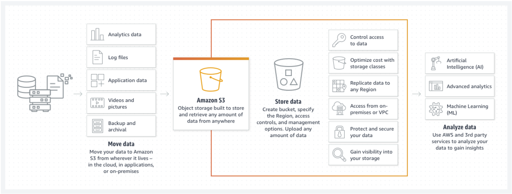

# Minio

https://zhuanlan.zhihu.com/p/654273720

MinIO 是一个高性能的对象存储服务器，用于构建云存储解决方案。它使用Golang编写，专为私有云、公有云和混合云环境设计。它是兼容Amazon S3 API的，并可以作为一个独立的存储后端或与其他流行的开源解决方案（如Kubernetes）集成。

MinIO 允许以对象的形式存储非结构化数据（如图片、视频、日志文件等）。与传统的文件系统（如NFS）或块存储（如iSCSI）相比，对象存储更易于扩展和管理。MinIO 提供简单的部署选项和易于使用的界面，允许你快速设置和访问存储资源。

Amazon Simple Storage Service (Amazon S3) 是一种对象存储服务

## Minio集群部署
### 部署架构

建议生产采用至少4节点(服务器),每节点2块磁盘的集群部署,磁盘越大越好了。
部署模式采用nginx【1+】+minIO分布式部署[4+]


### 部署方式
分布式MinIO
原因：单机MinIO存在单点故障
更多请参见：
http://docs.minio.org.cn/docs/master/distributed-minio-quickstart-guide
https://www.minio.org.cn/docs/minio/container/index.html
资源：
    考虑资源的有限，建议本次生产资源采用最小的申请，后续可根据情况水平扩容。
4节点，每个节点挂载2块以上的磁盘，每个磁盘空间10T+。这样N=4*2=8块磁盘
只要N/2=4在线，仍然可读  N/2+1=5可写
这样能够保证4个节点坏掉2个节点仍然可读，坏掉1个节点仍然可写。或者磁盘坏了4块仍然可读。保持5块可用仍然可写。

同时minIO采用的纠删码的方式实现高可用，它能够提供磁盘利用率，准且最高的数据冗余系数为2，磁盘和节点越多，利用率越高。
见：https://www.jianshu.com/p/0da45bc5cc0b

部署方式采用区的方式启动MinIO集群，利于后续水平扩容。

其他参考帖子：
http://docs.minio.org.cn/docs/master/distributed-minio-quickstart-guide 
https://blog.csdn.net/networken/article/details/112044111 
https://csdnnews.blog.csdn.net/article/details/114860023?spm=1001.2101.3001.6650.2&utm_medium=distribute.pc_relevant.none-task-blog-2%7Edefault%7ECTRLIST%7Edefault-2.no_search_link&depth_1-utm_source=distribute.pc_relevant.none-task-blog-2%7Edefault%7ECTRLIST%7Edefault-2.no_search_link
https://blog.51cto.com/u_14625168/category11.html 
https://blog.csdn.net/weixin_40816738/article/details/120400182
https://www.jianshu.com/p/79e1cb948253


创建minio集群网络
```shell
docker network create --scope=swarm --attachable -d overlay minio-net
```
minio集群docker-compose.yml部署编排文件
```shell

version: '3.7'

networks:
  network1:
    name: minio-net
    external: true

x-minio-common: &minio-common
  image: minio/minio
  environment:
    MINIO_ROOT_USER: admin
    MINIO_ROOT_PASSWORD: cfps@infosky #大于等于8位
    MINIO_VOLUMES: "/data"
  restart: always
  command: server /data --console-address ":9009"
  logging:
    options:
      max-size: "50M" # 最大文件上传限制
      max-file: "10"
    driver: json-file
  networks:
    - network1
  volumes:
    - /opt/mydata/minio-data:/data
    
services:
  minio1:
    <<: *minio-common
    hostname: minio1
    container_name: minio1
    ports:
        - "9002:9000" # api 端口
        - "9009:9009"
  minio2:
    <<: *minio-common
    hostname: minio2
    container_name: minio2
    ports:
        - "9003:9000" # api 端口
        - "9010:9009"

  minio3:
    <<: *minio-common
    hostname: minio3
    container_name: minio3
    ports:
        - "9004:9000" # api 端口
        - "9011:9009"
```
通过节点访问9009端口进入minio登录界面：
```shell
http://172.22.70.12:9009/login
http://172.22.70.15:9009/login
http://172.22.70.18:9009/login
```


## 管理MinIO部署

- 扩容 : 通过添加服务器池来增加 MinIO 部署的总存储容量。

- 升级 : 测试和部署最新稳定版本的 MinIO，以利用新功能、修复和性能改进。

- 退出 : 准备从部署中移除旧存储池前，从其中导出数据，保障数据的安全。
