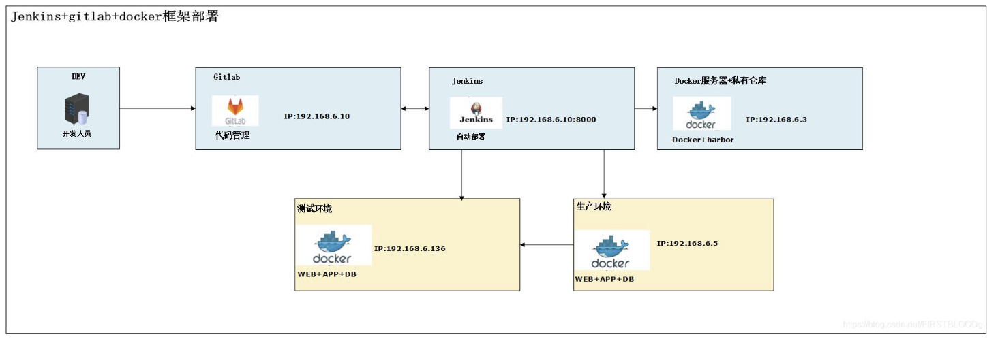
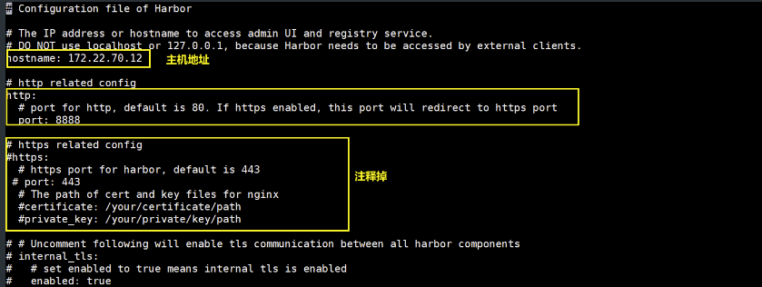
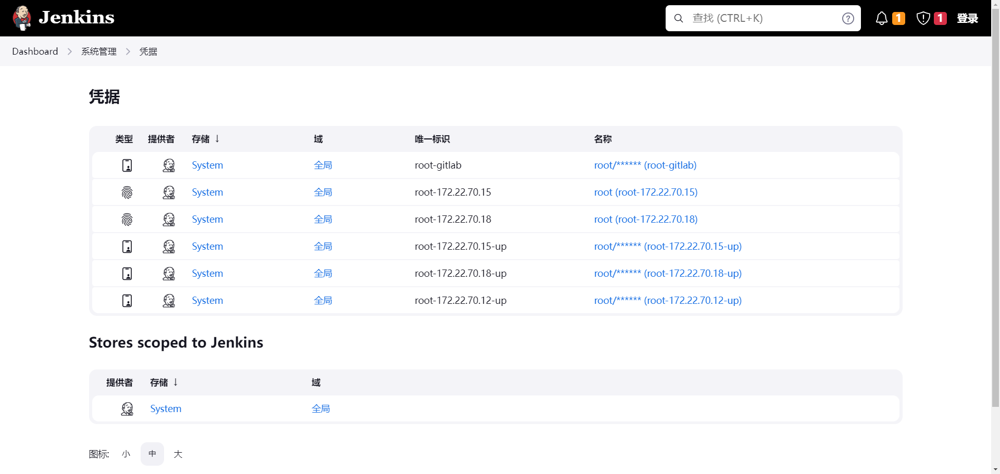
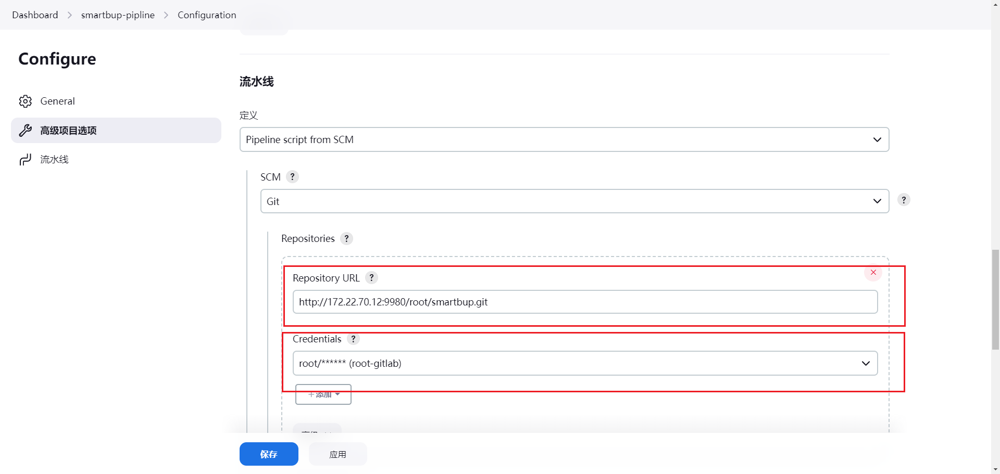
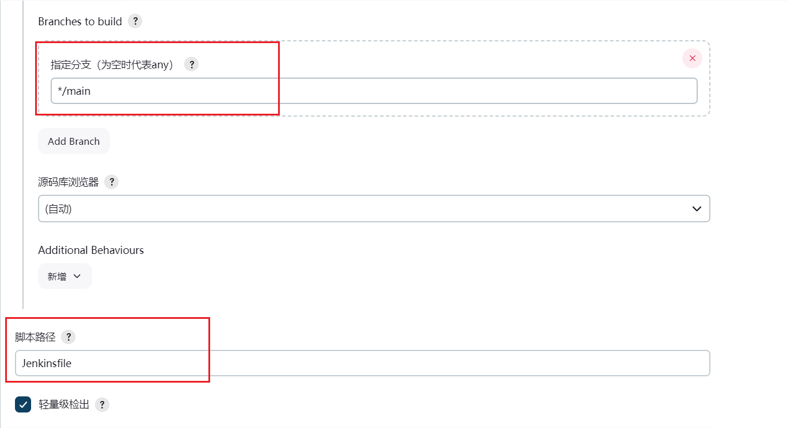

# CI/CD 持续集成与交付分发
## Jenkins + gitlab + harbor 自动集成构建发布docker镜像并部署应用服务



### 1. Gitlab 搭建
#### 部署
（1）拉取镜像
```shell
# 查找Gitlab镜像
docker search gitlab
# 拉取Gitlab镜像
docker pull gitlab/gitlab-ce:latest
```
（2）启动gitlab容器
```shell
# 启动容器
docker run \
 -itd  \
 -p 9980:80 \
 -p 9922:22 \
 -v /home/gitlab/etc:/etc/gitlab  \
 -v /home/gitlab/log:/var/log/gitlab \
 -v /home/gitlab/opt:/var/opt/gitlab \
 --restart always \
 --privileged=true \
 --name gitlab \
 gitlab/gitlab-ce
```
（3）容器配置
`接下来的配置请在容器内进行修改，不要在挂载到宿主机的文件上进行修改。否则可能出现配置更新不到容器内，或者是不能即时更新到容器内，导致gitlab启动成功，但是无法访问`

```shell
# 进入gitlab容器内
docker exec -i gitlab /bin/bash
```
进入gitlab容器内的bash之后进行配置：
```shell
#修改gitlab.rb
vi /etc/gitlab/gitlab.rb
```
按下 **i** 键，在gitlab.rb文件中添加如下配置：
```shell
#gitlab访问地址。如果端口默认为80
external_url 'http://172.22.70.12'
#ssh主机ip
gitlab_rails['gitlab_ssh_host'] = 'http://172.22.70.12'
#ssh连接端口
gitlab_rails['gitlab_shell_ssh_port'] = 9922
```
然后按下 **wq!** 组合键，保存文件修改后退出，然后输入下面命令让配置生效：
```shell
gitlab-ctl reconfigure
```

`注意不要重启，/etc/gitlab/gitlab.rb文件的配置会映射到gitlab.yml这个文件，由于在docker中运行，gitlab生成的http地址应该是http://172.22.70.12:9980。所以，修改下面gitlab.yml文件(仍然在gitlab容器内部)`
```shell
# 修改http和ssh配置
vi /opt/gitlab/embedded/service/gitlab-rails/config/gitlab.yml

# 将文件中的改为9980
gitlab:
    host: 172.22.70.12
    port: 9980 
    https: false

#重启gitlab 
gitlab-ctl restart
#退出容器 
exit  
```
（4）登录访问

按之前配置的host的地址与端口，访问 http://172.22.70.12:9980


（5）密码配置
`首次访问，直接出现登录界面不知道root的密码，可进行如下操作更改root密码`

```shell
# 进入容器内部
docker exec -it gitlab /bin/bash
```
```shell
# 进入控制台
gitlab-rails console -e production
# 查询id为1的用户，id为1的用户是超级管理员
user = User.where(id:1).first
# 修改密码为lhx123456
user.password='p@ssw0rd'
# 保存
user.save!
# 设置为true的时候，密码修改才算成功
# 退出控制台
exit
# 退出容器
exit
```

### 2. Harbor 搭建
#### 安装

（1）执行下面命令下载harbor包
```shell
# Github源
wget https://github.com/goharbor/harbor/releases/download/v2.9.1/harbor-offline-installer-v2.9.1.tgz
# 代理源（推荐）
wget https://ghproxy.com/https://github.com/goharbor/harbor/releases/download/v2.5.3/harbor-offline-installer-v2.5.3.tgz
```
（2）解压下载的harbor文件
```shell
 # 解压harbor文件
 tar -zxvf harbor-offline-installer-v2.5.3.tgz
 # 移动到 ~/harbor
 mv harbor ~/harbor
```
（3）进入harbor文件夹里
```shell
cd harbor
mv harbor.yml.tmpl harbor.yml
```
修改harbor.yml配置文件
```shell
vi harbor.yml
```
主要修改主机地址，端口以及将https配置注释掉



启动harbor
```shell
./install.sh
```
开启镜像扫描器(trivy)的启动：
```shell
# 开启trivy （默认安全扫描扫描器）
./install.sh --with-trivy
# 开启trivy 和 chartmuseum
./install.sh --with-trivy --with-chartmuseum
# 可选择其他镜像安全扫描器，默认为trivy
# Note: Please set hostname and other necessary attributes in harbor.yml first. DO NOT use localhost or 127.0.0.1 for hostname, because Harbor needs to be accessed by external clients.
# Please set --with-notary if needs enable Notary in Harbor, and set ui_url_protocol/ssl_cert/ssl_cert_key in harbor.yml bacause notary must run under https.
# Please set --with-trivy if needs enable Trivy in Harbor
# Please set --with-chartmuseum if needs enable Chartmuseum in Harbor
```

启动完成后登录：http://172.22.70.12:8888/进入harbor主页

```shell
# 登录初始用户账号密码
username : admin
password : Harbor12345
```

#### Cosign安装
https://edu.chainguard.dev/open-source/sigstore/cosign/how-to-install-cosign/

#### 镜像签名
在harbor中使用cosign进行signature
```shell
# 进入harbor目录
cd ~/harbor
# 启动harbor
./install.sh --with-notary --with-trivy
# 也可以直接使用启动
./install.sh --with-trivy --with-chartmuseum
```
采用cosgin生成cosign.key
```shell
$ cosign generate-key-pair
>>> Enter password for private key:
>>> Enter again:
>>> Private key written to cosign.key
>>> Public key written to cosign.pub
```
使用项目授权用户登录push镜像
```shell
# 登录harbor仓库
$ docker login <ip>:<port>
# push镜像
 docker push <镜像tag>
 # cosign镜像
 cosign sign --key cosign.key <镜像tag>
>>> Enter password for private key:
>>> Pushing signature to: xxxx
```
可以看到镜像添加上了cosign的标签

验证cosign镜像
```shell
 cosign verify --key cosign.pub <镜像tag> | jq .
 # 如果提示没有 jq 命令 json工具包 : 在centos下使用：
 yum -y install jq 
```
### 3. Jenkins搭建
使用docker部署Jenkins，运行jenkins（blueocean版本）
```shell
# 拉取jenkins镜像
docker pull jenkinsci/blueocean
# 运行jenkins实例
docker  run   -d -u root   -p 8080:8080   -v /usr/local/jenkins:/var/jenkins_home   -v /var/run/docker.sock:/var/run/docker.sock  -v "$HOME":/home -v /usr/local/apache-maven-3.5.4:/usr/local/maven  --name myjenkins jenkinsci/blueocean:latest
# 查看运行jenkins容器日志
docker logs myjenkins
```

通过浏览器访问 http://172.22.70.12:8099， 进入jenkins登录页面
首次登录密码在hudson.model.UpdateCenter.xml文件里查看
```shell
vim /usr/local/jenkins/hudson.model.UpdateCenter.xml
```
初始化jenkins，设置用户名和登录密码，安装推荐插件，等待运行。

```shell
# jenkins 插件安装
maven integration
git parameter
gitlab
Generic Webhook Trigger
ssh
CloudBees Docker Build and Publish
```
Jenkins 界面


#### 版本升级

```shell
# 进入jenkins容器
docker exec -it -u root myjenkins /bin/bash
# 进入jenkins文件夹
cd /usr/share/jenkins/
# 备份原war包
cp jenkins.war jenkins.war.bak
# 新建文件夹，存储新war包
mkdir other-version
cd other-version/
# 下载最新jenkins.war包
wget http://mirrors.jenkins.io/war-stable/latest/jenkins.war
# 删除原war包
cd /usr/share/jenkins
rm jenkins.war
# 将新war移动到 /usr/share/jenkins/下
cd other-version
mv jenkins.war ../
# 退出jenkins容器
exit
```
```shell
# 重启jenkins容器
docker restart myjenkins
```

#### Maven工具配置

配置JAVA_HOME(Centos)
https://www.cnblogs.com/lenmom/p/9494877.html


配置Maven设置settings文件路径

`注意：绑定maven的volume地址：-v /usr/local/apache-maven-3.5.4:/usr/local/maven`

`由于jenkins以docker的形式进行部署，maven的settings文件地址为容器内部的地址，因此jenkins里面maven配置的地址为/usr/local/maven。而启动时，绑定的maven settings文件地址为宿主机的-v /usr/local/apache-maven-3.5.4:/usr/local/maven`


`注意宿主机里maven的地址为/usr/local/apache-maven-3.5.4，然后将localmaven放在与apache-maven-3.5.4同一个目录下`


`注意：修改Maven settings文件里面的local Maven的地址：/usr/local/{local maven 的文件名}`


## 4. CI/CD 流程
`整个CI/CD流程：从gitlab上拉取项目代码 -> maven打包jar文件 -> 制作镜像 -> 推送镜像到远程harhor仓库 -> ssh远程目标主机创建服务`

### (1) 创建gitlab项目 

在gitlab中创建项目，并使用git将本地项目代码上传到gitlab对应的项目中  


### (2) Dockerfile
在项目根目录下添加用于制作Docker镜像的`Dockerfile`

`Dockerfile` (利用maven构建的jar包制作镜像)：
```shell
# 这个是需要的基础镜像
FROM openjdk:8
# 拷贝jar 到容器中
COPY ./pigx-upms/pigx-upms-biz/target/infosky-smartbup.jar /app.jar
# 暴露给外部的访问端口
EXPOSE 7011
# 启动命令
ENTRYPOINT ["java","-Duser.timezone=Asia/Shanghai", "-jar", "/app.jar"]
```
### (3) Jenkinsfile
在项目根目录下添加用于构建分发pipline的`Jenkinsfile`
```shell
pipeline {
    agent any

    tools{
        maven 'maven'
    }

    environment {
        project_url = "http://172.22.70.12:9980/root/smartbup.git"
        harbor_addr = "172.22.70.12:8888"
        harbor_pro = "dev"
        project_name = "smartbup"
        tag = "v1.0.1"
    }

    stages {
        stage('Pull Project') {
            steps {
                git branch: 'main', credentialsId: 'root-gitlab', url: 'http://172.22.70.12:9980/root/smartbup.git'
                echo 'Pull: Success !'
            }
        }

        stage('Prepare Maven') {
            steps {
                sh "mvn --version"
                sh "mvn clean install -Dmaven.test.skip=true"
            }
        }

        stage('Pack Image') {
            steps {
                sh '''
                #!/bin/bash
                echo "Start: Build image !"
                docker build -t ${harbor_addr}/${harbor_pro}/${project_name}:${tag} . 
                echo "Done: Build image !"
                exit 0
                '''
            }
        }

 stage('Prepare Harbor Registry'){
            steps {
                
                script{
                    def remote = [:]
                    remote.name = '172.22.70.12'
                    remote.host = '172.22.70.12'
                    remote.port = 22
                    remote.allowAnyHosts = true
                    //通过withCredentials调用Jenkins凭据中已保存的凭据，credentialsId需要填写，其他保持默认即可
                    withCredentials([usernamePassword(credentialsId: 'root-172.22.70.12-up', passwordVariable: 'password', usernameVariable: 'userName')]) {
                        remote.user = "${userName}"
                        remote.password = "${password}"
                    }
                    sshCommand remote: remote, command: """   
                        cd ~/harbor
                        cat << EOF > remote_harbor.sh 
                        #!/bin/bash
                        if test ! -z "\$(docker service ls | grep harbor)";then
                            echo "Harbor already ready!"
                        else
                            echo "Start Harbor..."
                            ./install.sh --with-trivy --with-chartmuseum
                        fi
                        EOF
                        sh remote_harbor.sh
                    """
                }
            }
        }

        stage('Push Image') {
            steps {
                sh '''
                #!/bin/bash
                docker login ${harbor_addr} -u admin -p Harbor12345
                docker push ${harbor_addr}/${harbor_pro}/${project_name}:${tag}
                docker logout ${harbor_addr}
                exit 0
                '''

            }
        }

        stage('Remote Pull Image'){
            steps {
                 script{
                    def remote = [:]
                    remote.name = '172.22.70.15'
                    remote.host = '172.22.70.15'
                    remote.port = 22
                    remote.allowAnyHosts = true
                    //通过withCredentials调用Jenkins凭据中已保存的凭据，credentialsId需要填写，其他保持默认即可
                    withCredentials([usernamePassword(credentialsId: 'root-172.22.70.15-up', passwordVariable: 'password', usernameVariable: 'userName')]) {
                        remote.user = "${userName}"
                        remote.password = "${password}"
                    }
                    sshCommand remote: remote, command: "docker pull ${harbor_addr}/${harbor_pro}/${project_name}:${tag}"
                }
                                 script{
                    def remote = [:]
                    remote.name = '172.22.70.18'
                    remote.host = '172.22.70.18'
                    remote.port = 22
                    remote.allowAnyHosts = true
                    //通过withCredentials调用Jenkins凭据中已保存的凭据，credentialsId需要填写，其他保持默认即可
                    withCredentials([usernamePassword(credentialsId: 'root-172.22.70.18-up', passwordVariable: 'password', usernameVariable: 'userName')]) {
                        remote.user = "${userName}"
                        remote.password = "${password}"
                    }
                    sshCommand remote: remote, command: "docker pull ${harbor_addr}/${harbor_pro}/${project_name}:${tag}"
                }
            }
        }

        stage('Deploy') {
            steps {
                sh '''
                #!/bin/bash
                docker login ${harbor_addr} -u admin -p Harbor12345
                docker pull ${harbor_addr}/${harbor_pro}/${project_name}:${tag}
                # 检查是否已经有同名的mysmartbup服务
                if test ! -z "$(docker service ls | grep -w ${project_name})";then
                    echo "Already has < ${project_name} > service"
                    docker service rm ${project_name}
                    echo "Removed original < ${project_name} > service"
                else
                    echo "No < ${project_name} > service"
                fi
                # 检查是否已经有同名的docker网络
                if test ! -z "$(docker network ls | grep -w ${project_name}-net)";then
                    echo "Already has < ${project_name}-net > network"
                    # docker network rm ${project_name}-net
                    # 创建docker swarm 服务网络
                    # echo "Removed original < ${project_name}-net > network"
                    # docker network create -d overlay ${project_name}-net
                    # echo "Created New< ${project_name}-net > network"
                else
                    echo "No < ${project_name}-net > network"
                    docker network create -d overlay ${project_name}-net
                    echo "Created New< ${project_name}-net > network"
                fi

                # 创建 docker swarm 服务
                echo "Start create < mysmartbup > service"
                docker service create --name ${project_name} --network ${project_name}-net -p 7011:7011 --replicas 3 ${harbor_addr}/${harbor_pro}/${project_name}:${tag}
                docker service ls
                echo "Done."
                # 退出docker登录
                docker logout ${harbor_addr}
                exit 0
                '''
            }
        }

         stage('Scale') {
            steps {
                sh '''
                #!/bin/bash
                docker service ls
                # scale service to 6
                docker service scale ${project_name}=6
                docker service ls
                exit 0
                '''
            }
        }

    }
}

```

### (4) 添加Cridential
Cridentials：登录目标主机的ssh/账号密码
凭据管理 -> 设置需要远程登录访问的主机地址和登录账号密码（或者ssh密匙）





### (5) 创建Piple流水线项目

参考文档：https://www.jenkins.io/zh/doc/book/pipeline/getting-started/

流水线选择Pipeline script from SCM，填入gitlab中需要构建的仓库地址（注意填入的仓库项目地址是否正确），选择对应的gitlab登录Credentials，通过Git，Dockerfile 和 Jenkinsfile构建



选择代码仓库项目里需要构建的分支，并指定Jenkinsfile文件的路径
`注意路径一定要对应否则pipline无法生效`



### (6) 构建分发项目服务


